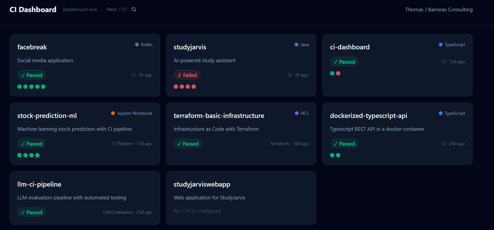
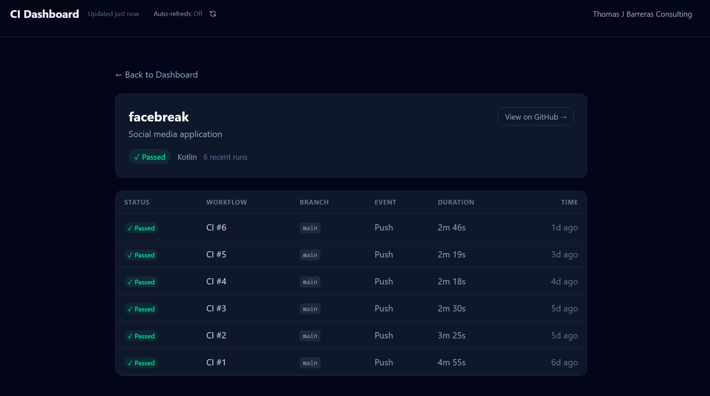

# CI Dashboard

**A single-pane view of build health across an entire GitHub organization — shipped as a static site, refreshed in real time.**

> **[View the live dashboard →](https://thomas-j-barreras-consulting.github.io/ci-dashboard/)**



** Project drilldown

---

## What this project demonstrates

This is a production-grade reference project by **[Thomas J Barreras Consulting](https://thomas-j-barreras-consulting.github.io/ci-dashboard/)**, built to showcase the kind of modern front-end work we deliver for clients.

In a single, deployable app it exercises:

- **Modern React architecture** — React 19, TypeScript strict mode, functional components, custom hooks, and clean separation between API, state, and presentation layers.
- **Resilient API integration** — typed GitHub REST client with ETag-based HTTP caching, in-memory TTL cache, and graceful error propagation.
- **Rate-limit-aware polling** — adaptive refresh intervals that automatically slow down or pause as the GitHub API quota shrinks, then resume at the reset window. No 429s, no dropped updates.
- **Real-time UX polish** — live countdown to next refresh, manual refresh, loading and refreshing states, non-blocking rate-limit banners, and an accessible status system.
- **Thoughtful UI/UX** — dark-mode-first design, responsive grid layout, per-repo drill-down routing, and visual cues that make red builds obvious at a glance.
- **Test-first engineering** — unit and integration tests with Vitest, React Testing Library, and MSW for realistic network mocking.
- **Zero-infrastructure deployment** — ships as static assets to GitHub Pages through a one-command pipeline.

---

## Technology stack

| Layer | Tools |
|---|---|
| Framework | React 19, React Router 7 |
| Language | TypeScript 6 (strict) |
| Build | Vite 8 |
| Styling | Tailwind CSS 4 |
| Testing | Vitest, React Testing Library, MSW, jsdom |
| Quality | ESLint 9, typescript-eslint |
| Hosting | GitHub Pages (static) |

---

## Architectural highlights

- **`useDashboardData`** — a single composable hook that owns fetch lifecycle, cache reads, error state, and adaptive scheduling. UI components stay thin and declarative.
- **Adaptive scheduler** — reads live rate-limit headers after every request and re-plans the next refresh. Three tiers: normal (5 min), slow (8 min when remaining ≤ 15), and paused (resume at reset when remaining ≤ 5).
- **ETag caching** — conditional requests keep quota usage low and payloads small, so the dashboard can poll aggressively without burning through the 60 req/hr unauthenticated limit.
- **HashRouter for static hosting** — client-side routing with deep-linkable repo detail pages on a pure static deploy, no server rewrites required.

---

## Running locally

```bash
npm install
npm run dev        # Vite dev server with HMR
npm test           # Vitest suite
npm run build      # Type-check + production build
npm run deploy     # Publish dist/ to GitHub Pages
```

---

## Work with us

If you need this kind of engineering — clean React front-ends, resilient API integration, or pragmatic DevOps tooling — **[Thomas J Barreras Consulting](https://thomas-j-barreras-consulting.github.io/ci-dashboard/)** is available for commissioned work.
